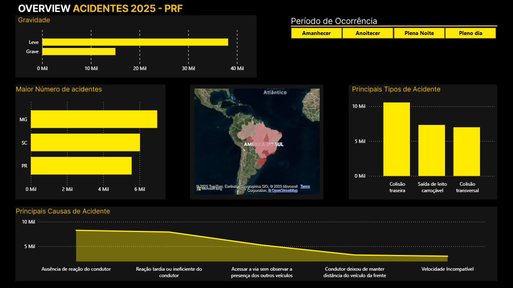

# PRF Data Pipeline — Acidentes nas Rodovias Federais

Este projeto implementa um pipeline completo de Engenharia de Dados (ETL) para processar os dados públicos de acidentes da Polícia Rodoviária Federal (PRF) referentes ao ano de 2025. O objetivo é transformar os dados brutos (extraídos de arquivos .csv) em uma base de dados limpa, estruturada e confiável, pronta para ser consumida. O intuito final é habilitar análises e a criação de dashboards que permitam extrair insights valiosos para a tomada de decisão e a formulação de ações de prevenção de acidentes.

## Etapas do Projeto
1. Coleta dos dados (CSV)
2. Limpeza e padronização dos dados com Pandas e Numpy
3. Armazenamento em banco MySQL
4. Visualização e análise no Power BI

## Tecnologias Utilizadas
- Python (Pandas, NumPy, SQLAlchemy)
- MySQL
- Docker
- Power BI

## Resultados
Os dashboards revelam padrões importantes para tomada de decisão relacionadas a segurança nas rodovias federais, como:
- Estados com maior número de acidentes
- Mapa de calor (Heatmap) apresentando os estados com maior número de acidentes
- Períodos do dia mais perigosos
- Tipos de acidentes mais recorrentes
- Visualização do número acidentes graves e leves
- Principais tipos de acidentes
- Principais causas dos acidentes

## Dashboard Final no Power BI

Aqui está uma prévia do dashboard interativo criado a partir dos dados limpos e carregados no banco MySQL.

O arquivo `.pbix` completo também está disponível neste repositório.

## 🧑‍💻 Autor
Alisson Lima Moreira
📍 Estudante de Engenharia de Software | Foco em Engenharia de Dados
🔗 [LinkedIn](https://linkedin.com/in/alissonlmmoreira)